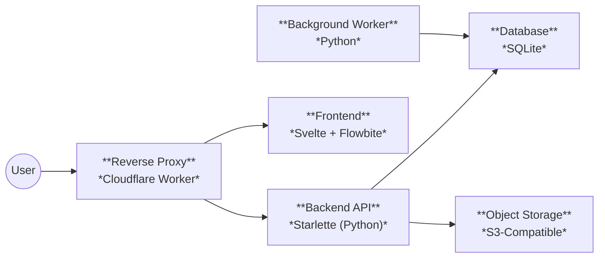
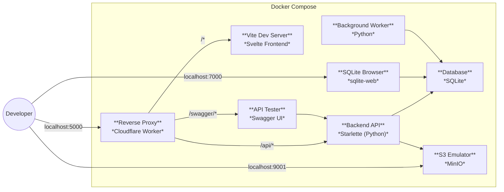
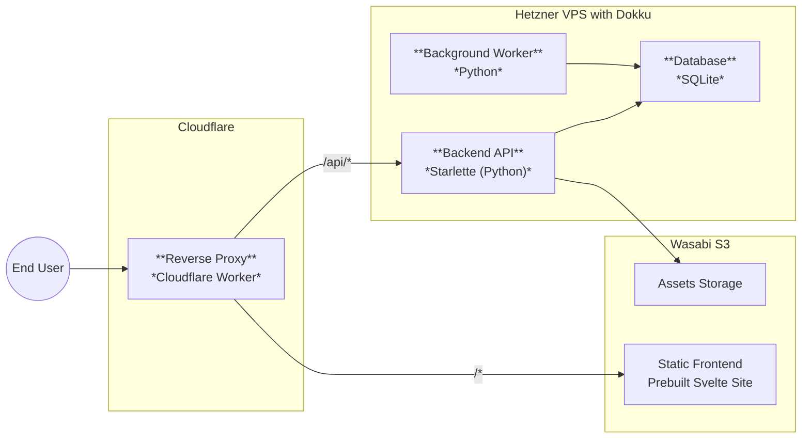

# Architecture Overview

- [System Components](#system-components)
  - [Reverse Proxy](#reverse-proxy)
  - [Frontend](#frontend)
  - [Backend API](#backend-api)
  - [Database](#database)
  - [Object Storage](#object-storage)
  - [Background Worker](#background-worker)
- [Local Development Environment](#local-development-environment)
- [Production Deployment](#production-deployment)

This document provides a high-level overview of the system's architecture and describes how the system functions in both the local development and production environments.

## System Components

The system consists of several key components that work together:

### Reverse Proxy
- All traffic to our website goes through a [Cloudflare Worker](https://developers.cloudflare.com/workers/)
- Routes requests to backend or frontend based on UI
- Handles language detection and redirects
- Sets caching headers that allow for content to be served from Cloudflare's CDN
- Code can be found in [/src/cf-worker/src/index.ts](/src/cf-worker/src/index.ts)

### Frontend
- Built with [Svelte](https://svelte.dev/) and TypeScript
- Uses [TailwindCSS](https://tailwindcss.com/) and [Flowbite](https://flowbite.com/) for UI components 
- Uses [typesafe-i18n](https://github.com/ivanhofer/typesafe-i18n) for internationalization
- Statically generated and served as static files in production
- Code can be found in [`/src/frontend/`](/src/frontend/)

### Backend API
- RESTful web API that handles all interactions with the database
- Built with Python using the [Starlette](https://www.starlette.io/) framework
- Automatically generated OpenAPI schema
- Code can be found in [`/src/backend/api/`](/src/backend/api/)
- For detailed implementation patterns, see [Backend Architecture](backend.md)

### Database
- SQLite database which lives on the same file system as the backend API
- Used for storing the majority of data required to run the site
- For complete schema details, see [Database Schema](database.md)
- For details on accessing data, see [Backend Architecture: Storage](backend.md#storage)

### Object Storage
- Cloud-hosted object storage for storing large files such as images, large text descriptions etc.
- Assumes an S3-Compatible API, however in production we are using [Wasabi](https://wasabi.com/cloud-object-storage) rather than AWS
- For details on how this integrates with the backend, see [Backend Architecture: Storage](backend.md#storage)

### Background Worker
- Python service for scheduled jobs
- Does not expose any endpoints to users
- Directly accesses the SQLite database
- Code can be found in [`/src/backend/worker/`](/src/backend/worker/)
- For more details, see [Backend Architecture: Background Worker](backend.md#background-worker)

## Local Development Environment

In the local development environment, all services are orchestrated using [Docker Compose](https://docs.docker.com/compose/). The services listed at the start of this document are implemented as follows:
- **Reverse Proxy**: Cloudflare worker emulated using [Wrangler](https://developers.cloudflare.com/workers/wrangler/).
- **Frontend**: Svelte application served by [Vite](https://vite.dev/), enabling hot-module reloading
- **Backend API**: Python web server hosted inside a docker container
- **Database**: The SQLite database is stored in the `mkc-db` docker volume
- **Object Storage**: [MinIO](https://github.com/minio/minio) is used as an S3-compatible object storage that can be run locally
- **Background Worker**: Python app hosted inside a docker container

In addition we have the following services running:
- A web-based SQLite database browser for interacting with the database [sqlite-web](https://github.com/coleifer/sqlite-web)
- An API tester, [Swagger UI](https://swagger.io/tools/swagger-ui/), which provides a nice user interface for testing the backend API
- A web-based UI for MinIO, [MinIO Console](https://github.com/minio/console) is set up to explore the objects

The following routes are exposed for interacting with the development environment:
- Website (via Cloudflare Worker): http://localhost:5000/
- Swagger UI: http://localhost:5000/swagger/
- SQLite Web: http://localhost:7000/
- MinIO Console: http://localhost:9001/

For detailed setup instructions, see [Developer Onboarding](onboarding.md).

## Production Deployment

In production, we have a [Hetzner VPS](https://www.hetzner.com/cloud/) running [Dokku](https://dokku.com/) to manage the apps. The core services are implemented as follows:
- **Reverse Proxy**: Cloudflare worker deployed and running on Cloudflare
- **Frontend**: Svelte app is statically generated and uploaded to the object storage with routing fully handled by the Cloudflare worker
- **Backend API**: Python web server hosted inside a docker container managed by Dokku
- **Database**: The SQLite database is stored on disk on the VPS
- **Object Storage**: [Wasabi](https://wasabi.com/cloud-object-storage) is used for object storage
- **Background Worker**: Python app hosted inside a docker container managed by Dokku
