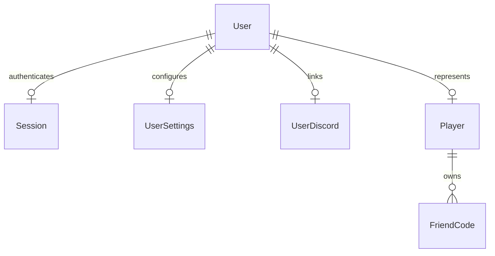
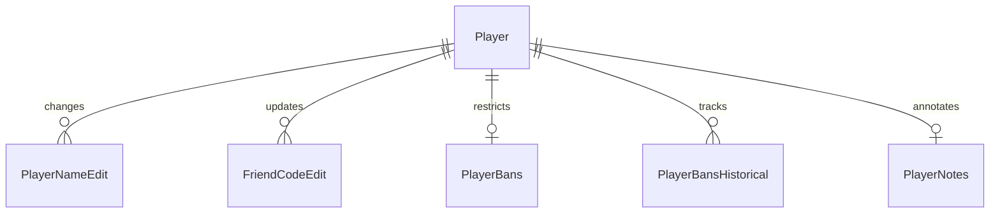
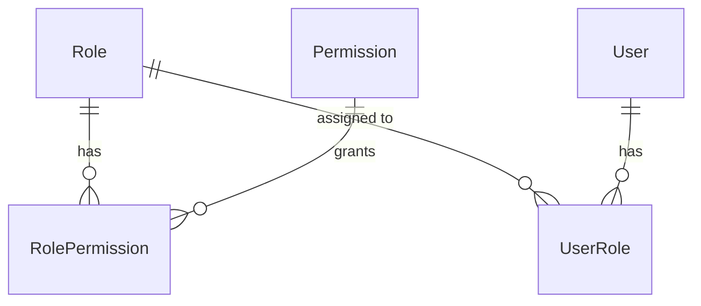
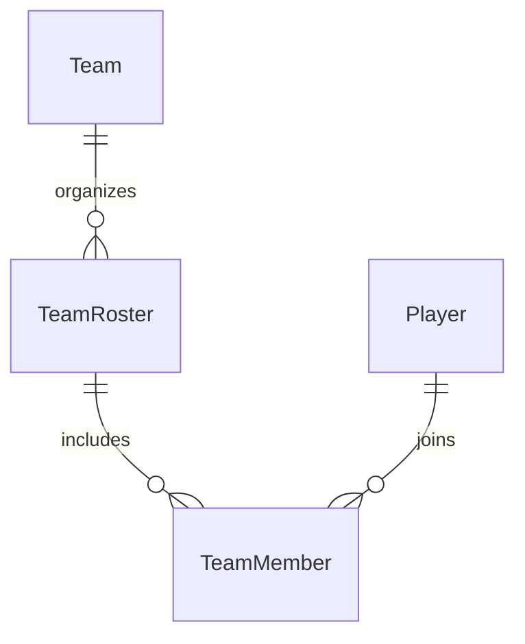
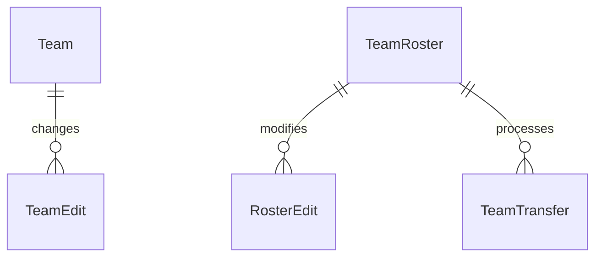
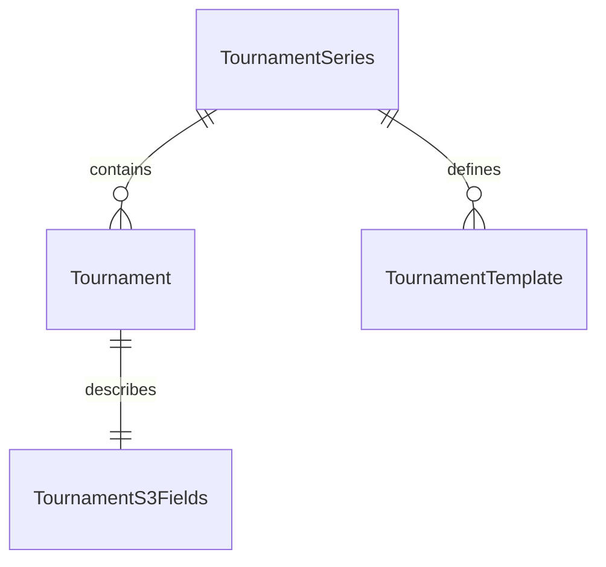
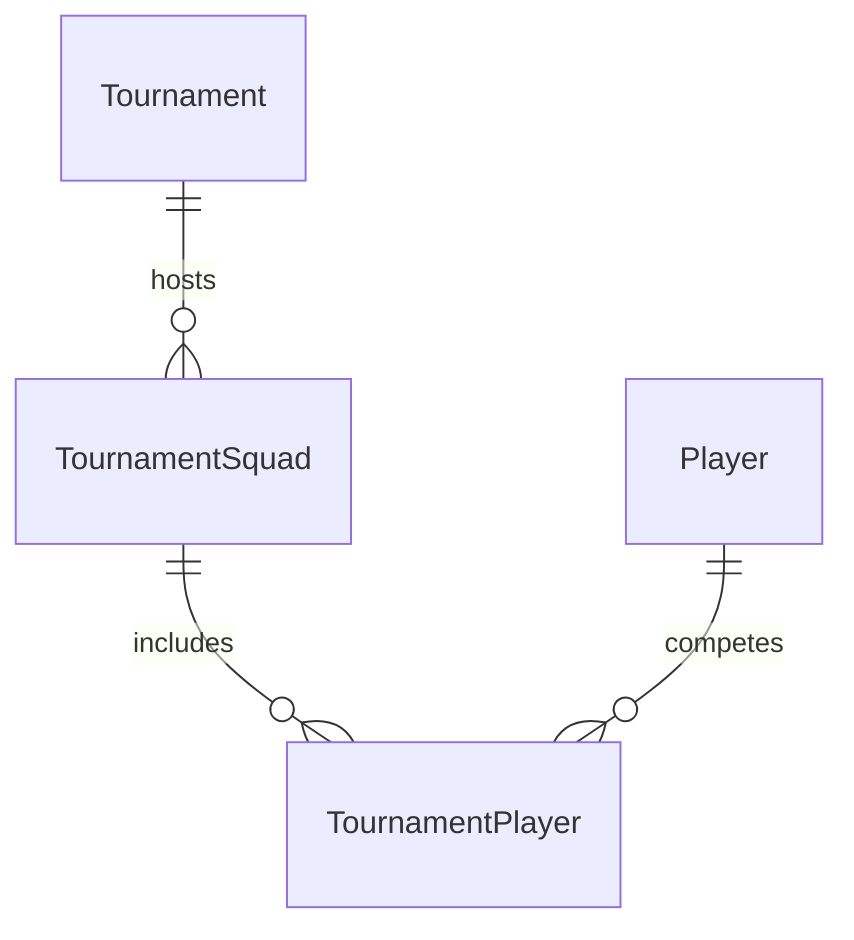
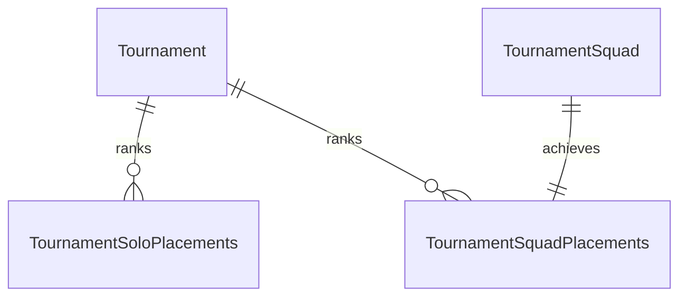
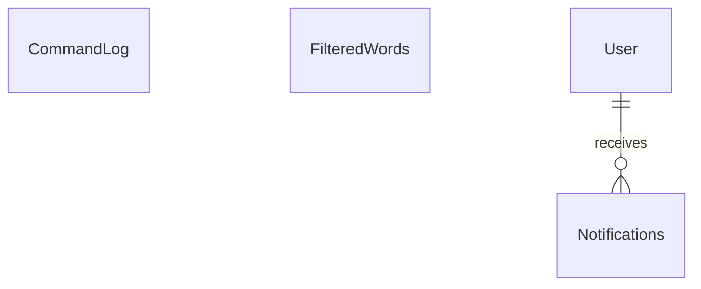

# Database Schema

- [Overview](#overview)
  - [Design Considerations](#design-considerations)
  - [Database Principles](#database-principles)
- [Core Identity System](#core-identity-system)
  - [User vs. Player Distinction](#user-vs-player-distinction)
  - [User Management Tables](#user-management-tables)
  - [Player Identity Tables](#player-identity-tables)
- [Player History and Moderation](#player-history-and-moderation)
  - [Change Management Tables](#change-management-tables)
  - [Moderation Tables](#moderation-tables)
- [Role-Based Access Control](#role-based-access-control)
  - [Role Structure Tables](#role-structure-tables)
- [Team System](#team-system)
  - [Team Organization Tables](#team-organization-tables)
  - [Team Management Tables](#team-management-tables)
- [Tournament System](#tournament-system)
  - [Tournament Structure Tables](#tournament-structure-tables)
  - [Tournament Participation Tables](#tournament-participation-tables)
  - [Tournament Results Tables](#tournament-results-tables)
- [Administrative Systems](#administrative-systems)
  - [Administrative Tables](#administrative-tables)
- [Database Migrations](#database-migrations)
  - [Migration Capabilities](#migration-capabilities)
  - [Migration Limitations](#migration-limitations)
  - [Developer Guidelines](#developer-guidelines)

The Mario Kart Central database is built on SQLite and organized into several logical components. This document outlines the core database structures and their relationships.

## Overview 

The schema is defined through Python dataclasses in [`/src/backend/common/data/db/tables.py`](/src/backend/common/data/db/tables.py) and automatically migrated on startup to ensure schema and code stays in sync. For implementation details of the backend services using this schema, see [Backend Architecture](backend.md).

### Design Considerations

- **SQLite Choice**: We selected SQLite for its simplicity, minimal resource requirements, and reliability. As our expected database size is relatively small even with projected growth, SQLite provides excellent performance without the operational complexity of client-server database systems.

- **Performance Strategy**: Our application runs on a single VPS, making performance a critical consideration. We use SQLite's WAL journal mode and NORMAL synchronous setting to balance performance and data integrity. The database stores only relational data that benefits from structured queries, with larger content stored in S3 (see [Backend Architecture: Storage](backend.md#storage)).

- **Scale Expectations**: We should design the database such that it can scale up to hundreds of thousands of users. Traffic will be primarily bursty (e.g., tournament sign-ups) rather than constant, as most players will interact with the community in discord rather than the website.

### Database Principles

- All dates are stored as Unix timestamps
- Foreign keys are used extensively to maintain data integrity 
- History tables track important changes for auditing
- Database indices are defined in [`/src/backend/common/data/db/indices.py`](/src/backend/common/data/db/indices.py)
- Direct SQL queries are used (no ORM) with parameterized statements

## Core Identity System

### User vs. Player Distinction

The system maintains a careful separation between authentication accounts (Users) and game identities (Players):

- **User**: Represents an authenticated account on the website with login credentials
- **Player**: Represents a public identity within the Mario Kart community

This separation exists because:
1. Some users may be non-players (e.g., administrators, tournament organizers)
2. We track players who haven't created user accounts (imported from tournament data)
3. The distinction allows for cleaner permission modeling

### User Management Tables

**User**
- Core account table storing authentication credentials
- Links to one Player record for users who are also players
- Primary key for permission assignments

**UserSettings**
- Stores user preferences and profile customization options

**Session**
- Tracks active login sessions for authenticated users

**UserDiscord**
- Manages Discord integration for communication features

### Player Identity Tables

**Player**
- Contains public gaming profile with display name and region
- Each player may be linked to at most one user account
- Players without linked users represent imported historical data

**FriendCode**
- Stores Nintendo network identifiers for various systems
- Players can have multiple codes across different systems

**PlayerClaim**
- Manages the process of claiming ownership of imported profiles

## Player History and Moderation

### Change Management Tables

**PlayerNameEdit**
- Tracks all player name change requests
- Maintains a history of name changes for moderation purposes

**FriendCodeEdit**
- Records modifications to player friend codes
- Preserves history of code changes and validation status

### Moderation Tables

**PlayerBans**
- Manages active player restrictions within the system
- Supports temporary and permanent ban implementation

**PlayerBansHistorical**
- Archives completed or expired ban records
- Provides historical context for moderation decisions

**PlayerNotes**
- Provides staff-only documentation about players
- Supports internal communication for moderation purposes

## Role-Based Access Control

The permission system is implemented across four scopes using the same table pattern. For complete details on how permissions are resolved and managed, see [Authentication & Authorization](auth.md).

### Role Structure Tables

Each scope (global, team, series, tournament) implements:

**Role**
- Named position with numeric hierarchy value
- Position determines management capabilities (lower positions manage higher)

**Permission**
- Named capability within the system
- Specific action or resource access right

**RolePermission**
- Maps roles to permissions with explicit grant/deny
- Controls fine-grained access within each scope

**UserRole**
- Assigns roles to users within each scope
- Supports temporary role assignments (e.g., bans)

For complete details on how these tables are used, see [Authentication & Authorization](auth.md).

## Team System

### Team Organization Tables

**Team**
- Top-level organization entity for competitive play
- Contains core team identity and configuration

**TeamRoster**
- Implements game-specific subteams within a parent team
- Enables teams to compete across multiple game titles

**TeamMember**
- Records player participation in specific rosters
- Tracks membership status and special designations

### Team Management Tables

**TeamEdit**
- Tracks changes to team properties
- Maintains history of team modifications

**RosterEdit**
- Similar to TeamEdit but focused on roster properties
- Preserves roster change history

**TeamTransfer**
- Processes player movement between rosters
- Records player transfers and their approval state

## Tournament System

### Tournament Structure Tables

**TournamentSeries**
- Groups related tournaments into logical series
- Provides organizational framework for events

**Tournament**
- Represents individual competition instance
- Core entity for tournament management

**TournamentS3Fields**
- References to S3 objects containing tournament descriptions and rulesets
- S3 files follow naming convention `{id}.json`

**TournamentTemplate**
- Stores reusable tournament configurations
- Streamlines creation of recurring events

### Tournament Participation Tables

**TournamentSquad**
- Manages team-based tournament participation
- Represents groups competing together

**TournamentPlayer**
- Records individual tournament participation
- Links players to their competitive squads

### Tournament Results Tables

**TournamentSoloPlacements**
- Records individual tournament results
- Tracks player performance in solo events

**TournamentSquadPlacements**
- Manages team-based tournament results
- Captures squad performance metrics

## Administrative Systems

### Administrative Tables

**FilteredWords**
- Simple list of words and phrases to be filtered from user content
- Standalone table with no relationships to other entities

**CommandLog**
- Temporary storage for recent system commands
- Periodically archived to S3 for long-term storage
- Used for auditing and potential data recovery

**Notifications**
- Handles user communication within the system
- Manages delivery of various notification types

## Database Migrations

The schema is automatically kept in sync with code through a migration system implemented in [`UpdateDbSchemaCommand`](/src/backend/common/data/commands/system/db_admin.py). This process:

1. Creates a clean in-memory database from current table definitions
2. Compares it against the actual schema
3. Generates and executes necessary migration SQL
4. Preserves existing data while maintaining constraints

### Migration Capabilities

The migration system can automatically:
- Create new tables
- Add columns to existing tables
- Create or update indices
- Handle schema updates across multiple tables

### Migration Limitations

There are important limitations to the automatic migration:
- **Column Removal**: The system will throw an error if a column is removed from the schema definition. This requires manual migration to preserve data.
- **Table Removal**: Removed tables are not dropped but are kept with a warning message that they should be manually cleaned up.
- **Complex Changes**: Schema changes involving column type changes or constraint modifications require manual intervention.

### Developer Guidelines

When working with the database:

1. **Adding Tables**:
   - Define new tables as dataclasses in [`/src/backend/common/data/db/tables.py`](/src/backend/common/data/db/tables.py)
   - Add indices in [`/src/backend/common/data/db/indices.py`](/src/backend/common/data/db/indices.py) if needed
   - The migration system will create them automatically

2. **Modifying Tables**:
   - Only add columns, never remove them
   - If a column must be removed, implement a custom migration script
   - Test migrations thoroughly before deployment

3. **Querying Best Practices**:
   - Always use parameterized queries (never string concatenation)
   - Include appropriate indices for frequently filtered fields
   - Keep queries simple and focused
   - Remember we don't use an ORM - all queries are direct SQL

4. **Transaction Management**:
   - Use transactions for related operations
   - Keep transactions short to avoid blocking
   - Handle exceptions appropriately to avoid unclosed transactions