# Database Schema

- [Overview](#overview)
  - [Database Structure](#database-structure)
  - [Database Principles](#database-principles)
- [Main Database (main.db)](#main-database-maindb)
  - [Player Identity System](#player-identity-system)
  - [Player History and Moderation](#player-history-and-moderation)
  - [Role-Based Access Control](#role-based-access-control)
  - [Team System](#team-system)
    - [Team Organization Tables](#team-organization-tables)
    - [Team Management Tables](#team-management-tables)
  - [Tournament System](#tournament-system)
    - [Tournament Structure Tables](#tournament-structure-tables)
    - [Tournament Participation Tables](#tournament-participation-tables)
    - [Tournament Results Tables](#tournament-results-tables)
  - [Administrative Tables](#administrative-tables)
- [Authentication Database (auth.db)](#authentication-database-authdb)
  - [User Management Tables](#user-management-tables)
- [Discord Tokens Database (discord_tokens.db)](#discord-tokens-database-discord_tokensdb)
- [User Activity Database (user_activity.db)](#user-activity-database-user_activitydb)
- [Sessions Database (sessions.db)](#sessions-database-sessionsdb)
- [Alt Flags Database (alt_flags.db)](#alt-flags-database-alt_flagsdb)
- [Player Notes Database (player_notes.db)](#player-notes-database-player_notesdb)
- [Database Migrations](#database-migrations)
  - [Migration Capabilities](#migration-capabilities)
  - [Migration Limitations](#migration-limitations)
  - [Developer Guidelines](#developer-guidelines)

The MKCentral database is built on SQLite and organized into several logical components. This document outlines the core database structures and their relationships.

## Overview 

The schema is defined through Python dataclasses in [`/src/backend/common/data/db/tables.py`](/src/backend/common/data/db/tables.py) and automatically migrated on startup to ensure schema and code stays in sync. For implementation details of the backend services using this schema, see [Backend Architecture](backend.md).

### Database Structure

The MKCentral database is physically split into multiple separate SQLite files to reduce the risk of security incidents and ensure that sensitive information cannot be accessed from non-sensitive requests:

1. **`main.db`**: Core application data (players, teams, tournaments, etc.)
2. **`auth.db`**: Authentication data (credentials, verification tokens)
3. **`sessions.db`**: Active user sessions and authentication state
4. **`discord_tokens.db`**: OAuth tokens for Discord integration
5. **`user_activity.db`**: User login history and IP tracking information

For details on working with these databases, see [Backend Architecture](backend.md#working-with-multiple-databases).

### Design Considerations

- **SQLite Choice**: We selected SQLite for its simplicity, minimal resource requirements, and reliability. As our expected database size is relatively small even with projected growth, SQLite provides excellent performance without the operational complexity of client-server database systems.

- **Performance Strategy**: Our application runs on a single VPS, making performance a critical consideration. We use SQLite's WAL journal mode and NORMAL synchronous setting to balance performance and data integrity. The database stores only relational data that benefits from structured queries, with larger content stored in S3 (see [Backend Architecture: Storage](backend.md#storage)).

- **Scale Expectations**: We should design the database such that it can scale up to hundreds of thousands of users. Traffic will be primarily bursty (e.g., tournament sign-ups) rather than constant, as most players will interact with the community in discord rather than the website.

### Database Principles

- All dates are stored as Unix timestamps
- Foreign keys are used extensively to maintain data integrity 
- History tables track important changes for auditing
- Database indices are defined in [`/src/backend/common/data/db/indices.py`](/src/backend/common/data/db/indices.py)
- Direct SQL queries are used (no ORM) with parameterized statements

### User vs. Player Distinction

The system maintains a careful separation between authentication accounts (Users) and public identities (Players):

- **User**: Represents an authenticated account on the website with login credentials
- **Player**: Represents a public identity within the Mario Kart community

This separation exists because:
1. Some users may be non-players (e.g., administrators, tournament organizers)
2. We track players who haven't created user accounts (imported from tournament data)
3. The distinction allows for cleaner permission modeling

## Main Database (main.db)

### Player Identity System

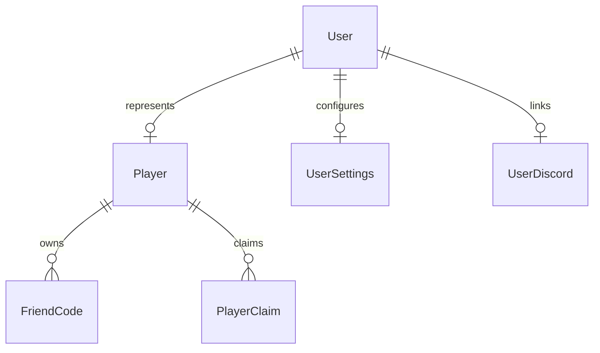

**Player**
- Contains public gaming profile with display name and region
- Each player may be linked to at most one user account
- Players without linked users represent imported historical data

**FriendCode**
- Stores Nintendo network identifiers for various systems
- Players can have multiple codes across different systems

**PlayerClaim**
- Manages the process of claiming ownership of imported profiles

**UserSettings**
- Stores user preferences and profile customization options

**UserDiscord**
- Manages Discord integration for communication features

### Player History and Moderation

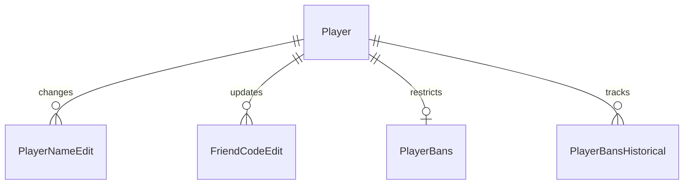

#### Change Management Tables

**PlayerNameEdit**
- Tracks all player name change requests
- Maintains a history of name changes for moderation purposes

**FriendCodeEdit**
- Records modifications to player friend codes
- Preserves history of code changes and validation status

#### Moderation Tables

**PlayerBans**
- Manages active player restrictions within the system
- Supports temporary and permanent ban implementation

**PlayerBansHistorical**
- Archives completed or expired ban records
- Provides historical context for moderation decisions

### Role-Based Access Control

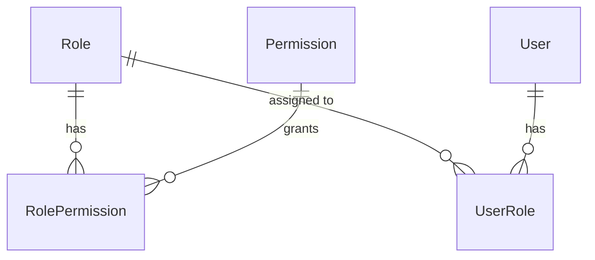

The permission system is implemented across four scopes using the same table pattern. For complete details on how permissions are resolved and managed, see [Authentication & Authorization](auth.md).

### Role Structure Tables

Each scope (global, team, series, tournament) implements:

**Role**
- Named position with numeric hierarchy value
- Position determines management capabilities (lower positions manage higher)

**Permission**
- Named capability within the system
- Specific action or resource access right

**RolePermission**
- Maps roles to permissions with explicit grant/deny
- Controls fine-grained access within each scope

**UserRole**
- Assigns roles to users within each scope
- Supports temporary role assignments (e.g., bans)

For complete details on how these tables are used, see [Authentication & Authorization](auth.md).

### Team System

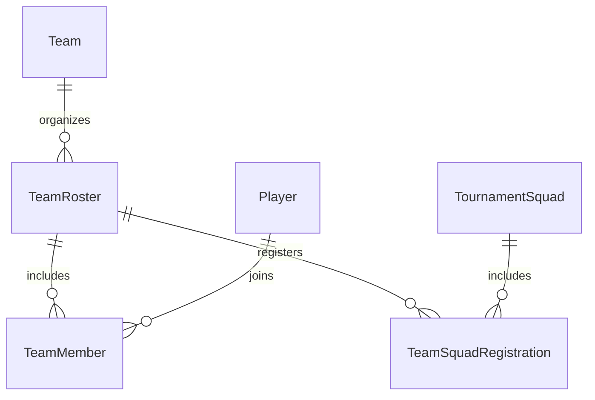

#### Team Organization Tables

**Team**
- Top-level organization entity for competitive play
- Contains core team identity and configuration

**TeamRoster**
- Implements game-specific subteams within a parent team
- Enables teams to compete across multiple game titles

**TeamMember**
- Records player participation in specific rosters
- Tracks membership status and special designations

#### Team Management Tables

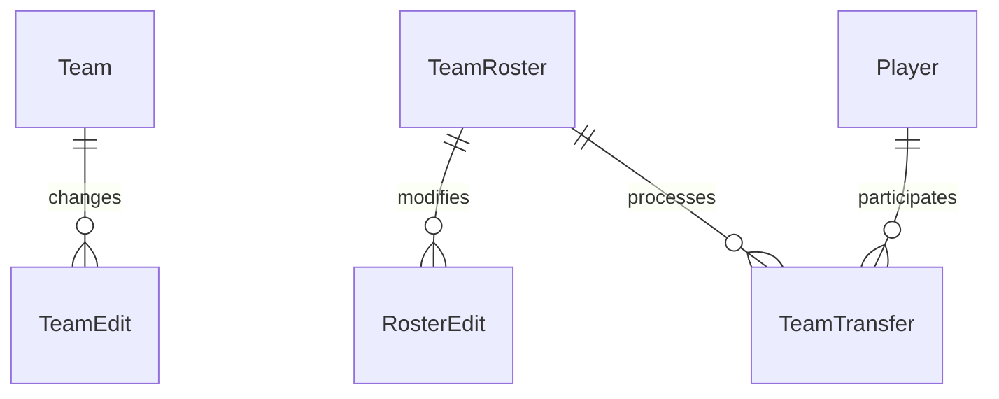

**TeamEdit**
- Tracks changes to team properties
- Maintains history of team modifications

**RosterEdit**
- Similar to TeamEdit but focused on roster properties
- Preserves roster change history

**TeamTransfer**
- Processes player movement between rosters
- Records player transfers and their approval state

### Tournament System

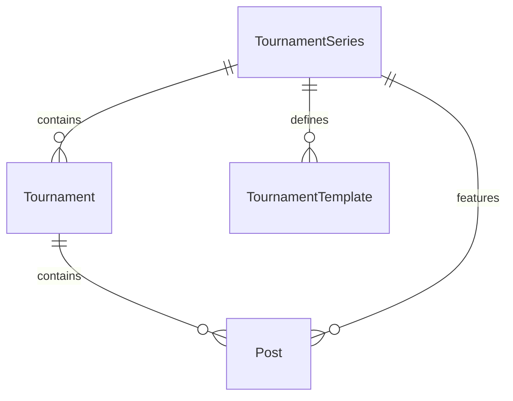

#### Tournament Structure Tables

**TournamentSeries**
- Groups related tournaments into logical series
- Provides organizational framework for events

**Tournament**
- Represents individual competition instance
- Core entity for tournament management

**TournamentTemplate**
- Stores reusable tournament configurations
- Streamlines creation of recurring events

**Post**
- Contains news or announcement content
- Can be associated with tournaments or series

#### Tournament Participation Tables

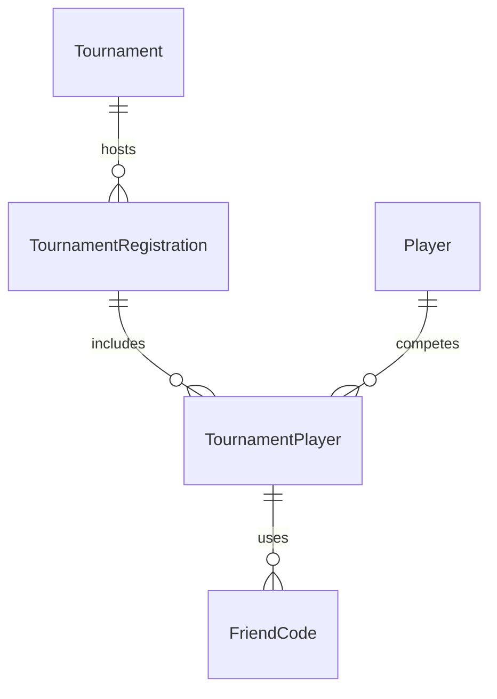

**TournamentRegistration**
- Catch-all for solo, squad, team registrations for tournaments
- Manages tournament participation
- Represents groups competing together

**TournamentPlayer**
- Records individual tournament participation
- Links players to their competitive squads

#### Tournament Results Tables

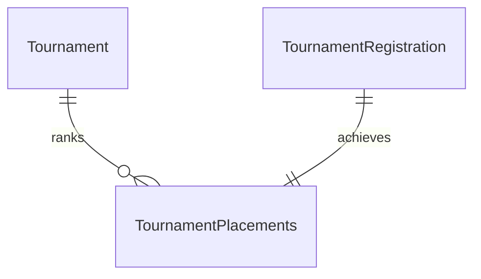

**TournamentPlacements**
- Records tournament results
- Tracks player/squad/team performance in events

### Administrative Tables

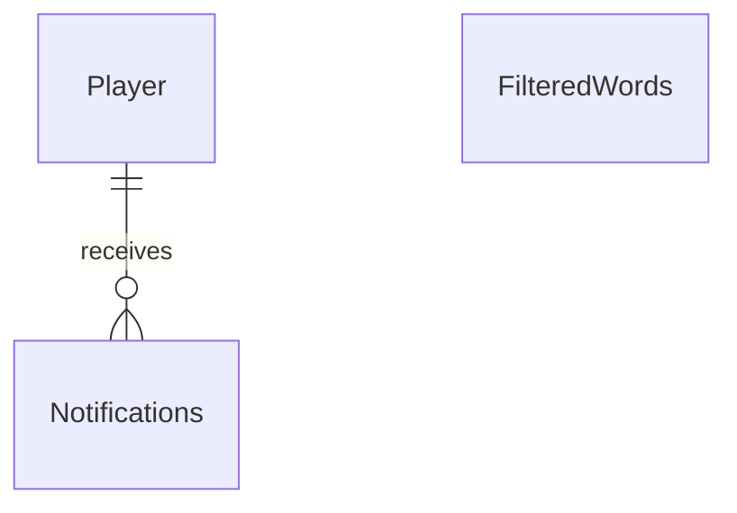

**FilteredWords**
- Simple list of words and phrases to be filtered from user content
- Standalone table with no relationships to other entities

**Notifications**
- Handles user communication within the system
- Manages delivery of various notification types

## Authentication Database (auth.db)

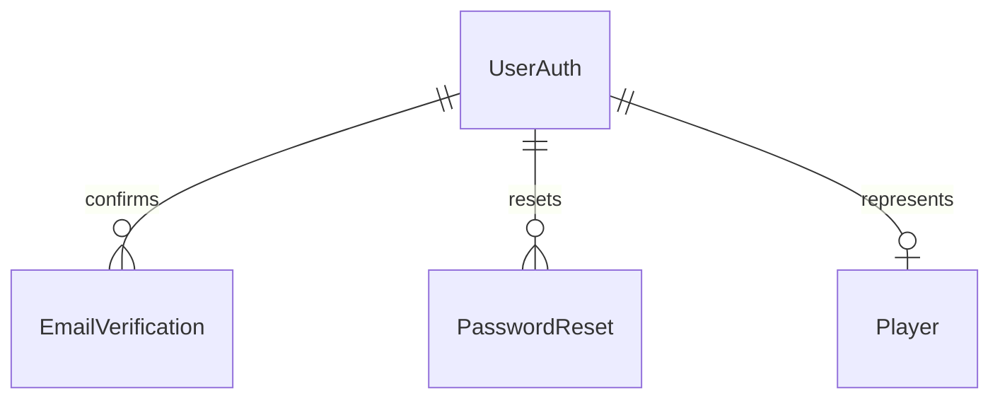

**UserAuth**
- Core account table storing authentication credentials (email, password_hash)
- Links to one Player record for users who are also players
- Primary key for permission assignments
- Contains email confirmation and password reset status flags

**EmailVerification**
- Stores tokens for email verification process
- Includes expiration timestamps for security

**PasswordReset**
- Manages password reset tokens
- Includes expiration timestamps for security

## Discord Tokens Database (discord_tokens.db)

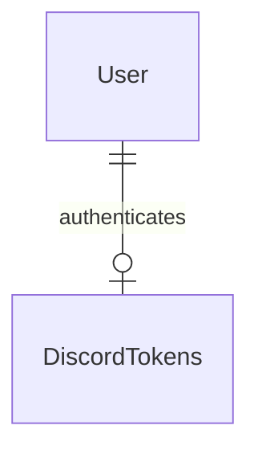

**DiscordTokens**
- Stores sensitive Discord OAuth2 tokens separate from the main database
- Contains access_token, refresh_token, and expiration timestamps
- Used for Discord API interactions and profile synchronization
- Separated for enhanced security of authentication credentials

## User Activity Database (user_activity.db)

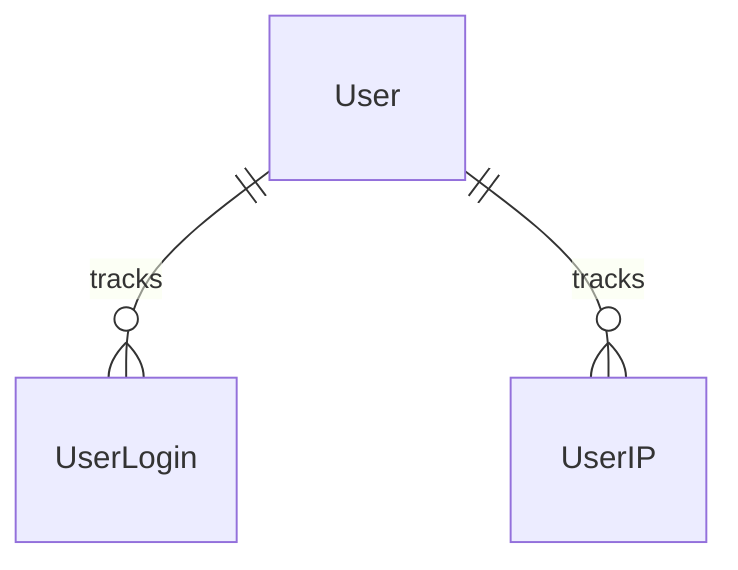

**UserLogin**
- Records user login history and session information
- Includes timestamps, login status, and device information
- Used for security monitoring and activity auditing

**UserIP**
- Stores IP addresses associated with user sessions
- Used for security monitoring and detecting suspicious access patterns
- Separated from main database for privacy and data minimization

## Sessions Database (sessions.db)

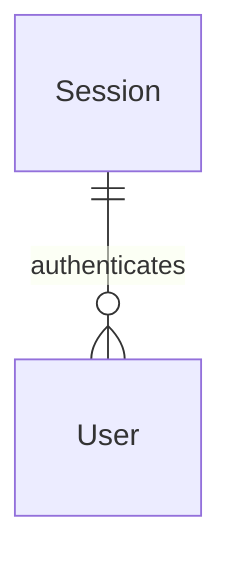

**Session**
- Tracks active login sessions for authenticated users
- Contains session_id, user_id, and expiration timestamp
- Stored in a separate database for performance and isolation

## Alt Flags Database (alt_flags.db)

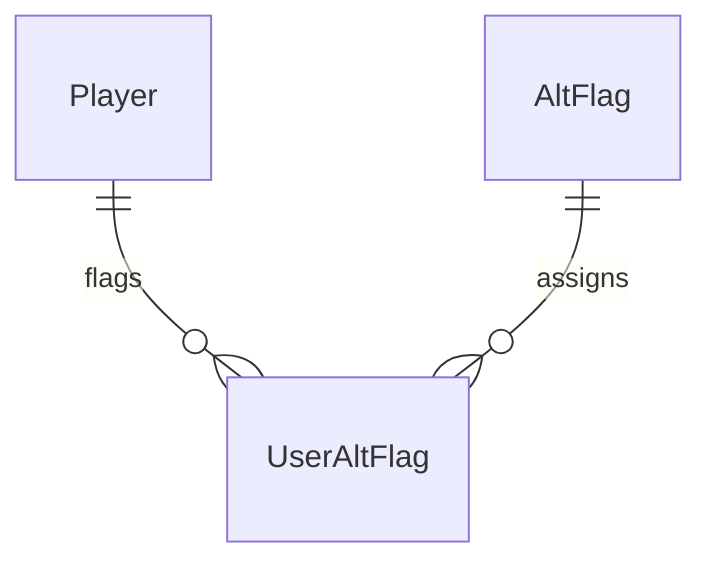

**AltFlag** and **UserAltFlag**
- System for tracking potential alternate accounts
- Used for moderation and player identity verification
- Separated to isolate user identity correlation data

## Player Notes Database (player_notes.db)

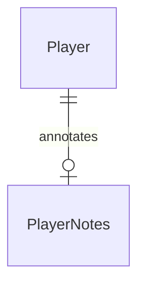

**PlayerNotes**
- Provides staff-only documentation about players
- Supports internal communication for moderation purposes
- Separated to isolate sensitive player information from main database

## Database Migrations

The schema is automatically kept in sync with code through a migration system implemented in [`UpdateDbSchemaCommand`](/src/backend/common/data/commands/system/db_admin.py). This process:

1. Creates a clean in-memory database from current table definitions
2. Compares it against the actual schema
3. Generates and executes necessary migration SQL
4. Preserves existing data while maintaining constraints

### Migration Capabilities

The migration system can automatically:
- Create new tables
- Add columns to existing tables
- Create or update indices
- Handle schema updates across multiple tables

### Migration Limitations

There are important limitations to the automatic migration:
- **Column Removal**: The system will throw an error if a column is removed from the schema definition. This requires manual migration to preserve data.
- **Table Removal**: Removed tables are not dropped but are kept with a warning message that they should be manually cleaned up.
- **Complex Changes**: Schema changes involving column type changes or constraint modifications require manual intervention.

### Developer Guidelines

When working with the database schema:

1. **Adding Tables**:
   - Define new tables as dataclasses in [`/src/backend/common/data/db/tables.py`](/src/backend/common/data/db/tables.py)
   - Add indices in [`/src/backend/common/data/db/indices.py`](/src/backend/common/data/db/indices.py) if needed
   - The migration system will create them automatically

2. **Modifying Tables**:
   - Only add columns, never remove them
   - If a column must be removed, implement a custom migration script
   - Test migrations thoroughly before deployment

For guidelines on querying and transaction management, see [Backend Architecture](backend.md#querying-best-practices).